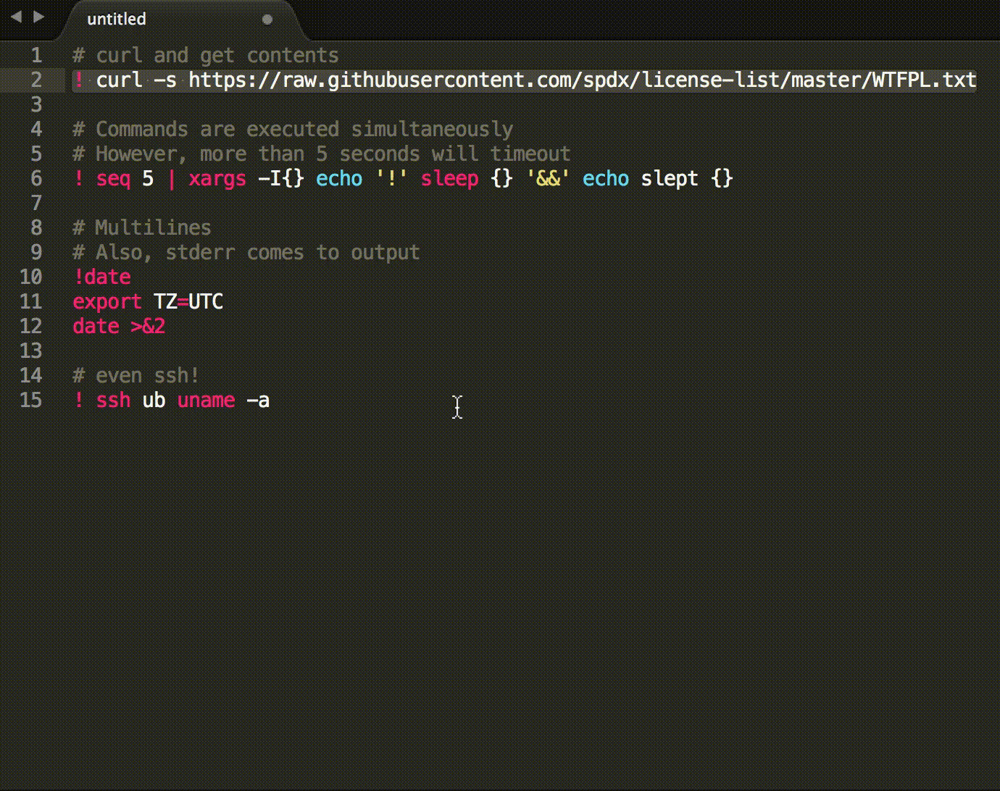

# Sublime Evaluate [](https://www.gittip.com/jbrooksuk/)
A powerful plugin which returns the value of selected regions.


## Installation

### By Package Control

1. Download & Install **`Sublime Text 3`** (https://www.sublimetext.com/3)
1. Go to the menu **`Tools -> Install Package Control`**, then,
    wait few seconds until the installation finishes up
1. Now,
    Go to the menu **`Preferences -> Package Control`**
1. Type **`Add Channel`** on the opened quick panel and press <kbd>Enter</kbd>
1. Then,
    input the following address and press <kbd>Enter</kbd>
    ```
    https://raw.githubusercontent.com/evandrocoan/StudioChannel/master/channel.json
    ```
1. Go to the menu **`Tools -> Command Palette...
    (Ctrl+Shift+P)`**
1. Type **`Preferences:
    Package Control Settings – User`** on the opened quick panel and press <kbd>Enter</kbd>
1. Then,
    find the following setting on your **`Package Control.sublime-settings`** file:
    ```js
    "channels":
    [
        "https://packagecontrol.io/channel_v3.json",
        "https://raw.githubusercontent.com/evandrocoan/StudioChannel/master/channel.json",
    ],
    ```
1. And,
    change it to the following, i.e.,
    put the **`https://raw.githubusercontent...`** line as first:
    ```js
    "channels":
    [
        "https://raw.githubusercontent.com/evandrocoan/StudioChannel/master/channel.json",
        "https://packagecontrol.io/channel_v3.json",
    ],
    ```
    * The **`https://raw.githubusercontent...`** line must to be added before the **`https://packagecontrol.io...`** one, otherwise,
      you will not install this forked version of the package,
      but the original available on the Package Control default channel **`https://packagecontrol.io...`**
1. Now,
    go to the menu **`Preferences -> Package Control`**
1. Type **`Install Package`** on the opened quick panel and press <kbd>Enter</kbd>
1. Then,
    search for **`EvaluateShell`** and press <kbd>Enter</kbd>

See also:

1. [ITE - Integrated Toolset Environment](https://github.com/evandrocoan/ITE)
1. [Package control docs](https://packagecontrol.io/docs/usage) for details.


# Evaluation Environment
Sublime Evaluate is able to evaluate the `math` and `datetime` import as part of its enviroment. This opens up access to a whole range of Python functions such as:

```python
math.atan2(80, 40)

math.pi * 60

datetime.date(2013,4,2) # Returns a formatted date

datetime.date.today()
```

We can also perform morecomplex expressions such as:

```python
(math.pi * 2) / math.pi * 0.5
```

# Evaluate Shell Script
Sublime Evaluate also supports evaluating code as shell script, Just add a `!` at the beginning:

```bash
! echo hello         # > hello

! ! true; echo $?    # > 1

# Even multilines
! for i in `seq 10`; do
  echo I got a $i
done

```

#### Current Working Dir
Current working dir is the Sublime install dir. You can get it with a `!pwd`.

#### Stderr
Stderr is captured as well as stdout.

#### Timeout
Currently a 5s timeout is set. You code will be terminated when it runs more than 5s.

#### OS/Sublime Support
Though the it is supposed to work on all OSs / Sublime 2/3, this feature is tested on macOS + Sublime 3.

Please kindly report to us if you find an issue. We'd be happy to fix it.

#### Demo


# License
MIT - [http://jbrooksuk.mit-license.org](http://jbrooksuk.mit-license.org)
